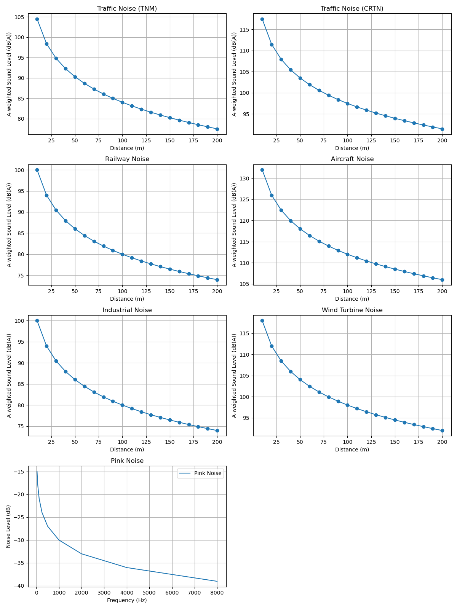

# Environmental Acoustics

DISCLOSURE: This project is intended to be used as a template or starting point for other projects. It is not a fully-functional or complete project and may require additional modifications and customization to be suitable for your specific needs. Use at your own risk.

contact: oren.sternberg@icloud.com

The EnvironmentalAcoustics class is a collection of methods for calculating different types of environmental noise levels. The following methods are included:

- `traffic_noise_tnm`: Calculate traffic noise based on distance, traffic volume, speed, and road type using a simplified version of the Federal Highway Administration (FHWA) Traffic Noise Model (TNM).
- `traffic_noise_crtn`: Calculate traffic noise based on distance, traffic volume, speed, and road type using the Calculation of Road Traffic Noise (CRTN) model.
- `railway_noise`: Calculate railway noise based on distance, train volume, speed, and track type.
- `aircraft_noise`: Calculate aircraft noise based on distance, flight volume, aircraft type, and flight path.
- `industrial_noise`: Calculate industrial noise based on distance, source level, source type, and terrain.
- `wind_turbine_noise`: Calculate wind turbine noise based on distance, turbine power, wind speed, and terrain.
- `weighted_sound_levels`: Calculate A-weighted sound levels for a given set of frequency bands and sound levels.
- `pink_noise`: Generate pink noise for a given frequency.

## Usage

To use the EnvironmentalAcoustics class, simply create an instance of the class:

```python
ea = EnvironmentalAcoustics()

#Then call one of the methods with the appropriate arguments:
traffic_noise_tnm_levels = ea.traffic_noise_tnm(distance, traffic_volume, speed, road_type)

```

## Examples
 Examples
The EnvironmentalAcoustics class comes with an example script 
that demonstrates how to use the different methods. The script generates various noise level plots based on different inputs. To run the example script, simply execute:

## Dependencies
The EnvironmentalAcoustics class requires the following dependencies:

- numpy
- matplotlib

## Output Example
)


## References

- Kinsler, L. E., Frey, A. R., Coppens, A. B., & Sanders, J. V. (2000). Fundamentals of acoustics. John wiley & sons. [link](https://books.google.com/books?hl=en&lr=&id=FecSEAAAQBAJ&oi=fnd&pg=PA1&dq=fundamentals+of+acoustics+4th+edition++kinsler&ots=rSyOGV5UOd&sig=b4pzjHwJM4MuUQoSHk-3jduJBtw)
